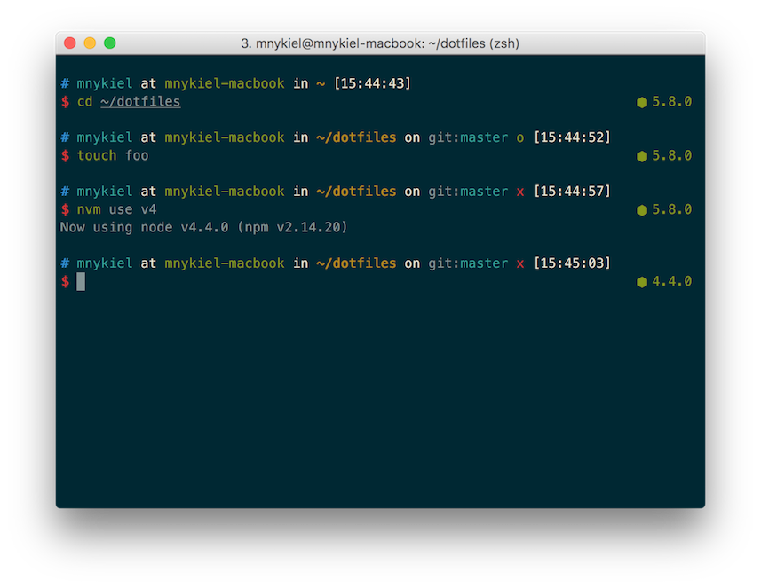

# Install Nodeys ZSH theme

Nodeys is a theme based on fantastic ys theme, with added NodeJS version (from NVM plugin).

## Install

```bash
vim ~/.oh-my-zsh/themes/nodeys.zsh-theme
# paste the file: nodeys.zsh-theme
```

## Screenshot



## License

The MIT License. [Author @Michał Nykiel](https://github.com/marszall87)
